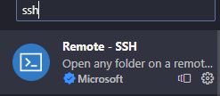
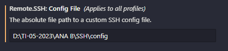

# Preparação de Ambiente
### Vamos preparar o ambiente para desnvolvimento de aplicações

#### Neste ambiente iremos instalar e configurar os seguintes recursos:
 - Marquina Virtual(Virtualbox)
 -Distribuição Linux (Ubuntu serve)
 Nasm
 - Compilador da limguagem C
 - configurar o ip e a porta de comunicação entre a máquina real e a virtual
 - Configurar o acesso via SSH entre o VScode e o ServidorLinux
 -Instalar as extensões: Material Icon, Nasm, SSH e Linguagem C/C++

 #### Máquina Virtual(Virtualbox)

 

 Máquina Virtual é uma ferramenta que permite a criação de novos "computadores" e a instalação de sistemas operacionais, para estudo ou trabalho.

 Para o nosso estudo iremos usar o VirtualBox, da Oracle.
 Para instalar, basta fazer o download no link a seguir:
 <a href="https://www.virtualbox.org/wiki/Downloads" target="_blank">VirtualBox </a>

 ##### Criando a máquina Virtual para o nosso estudo 

 - Configuração
   > - Nome da Máquina: Servidor
   > - Memória: 4GB(4096)
   > - Processador: 2
   > - Disco: 100GB
   > - IP e Porta do Host: 127.0.0.1 e 22
   > - IP e Porta do convidaddo: 10.0.2.15 e 22
   
   - tela inicial de configuração

 
- tela de configuração do hardware

 
 
 
- tela de configuração do disco

 
 
- tela de configuração final

 
- tela de configuração de rede

 
- tela de configuração do ip e das portas


#### Distribuiçao Ubuntu Server


Para o nosso estudo iremos utilizar uma distribuição linux para servidores chamada Ubuntu.
Acompanhe o processo de instalação:

Faça o download aqui:
<a href="https://ubuntu.com/download/server"target="_blank">ubuntu Server </a>

- Acompanhe a instalação

-Tela de inicio de instalação


- Tela de seleção de idioma


- Tela de seleção de teclado


- Tela de tipo de instalação


- Tela configuração de rede


- Tela configuração do proxy


- Tela pacotes de atualização

- Tela configuraçao do disco

- Tela configura do usuario


- Tela configuração do ssh


- Tela do fim da instalação 


#### Atualização do sistema

Para a correta utilização do servidor ubuntu que acabamos de instalar, será necessário realizar a atualização do sistema.

Execute o comando abaixo

```
sudo apt update -y  && sudo apt upgrade -y
```

reinicie o seu servidor usando o comando abaixo:

```
reboot
```
#### Instalação do compilador NASM
O compilador do NASM é uma ferramenta que nos permite programar em Assembly. Assim é possivel criar programas que manipulam dados que estão nos registradores do processador.

Para instalar o NASM ni ubuntu, usamos o comando:

```
sudo apt install nasm -y 
```
#### Instalção do compilador da Linguagem C

Em linux, o compilador da Liguagem C é o GCC. Ele é uma ferramenta importante para o desnvolvimento de programas em C

Para instalar use o comando:
```
sudo apt install gcc -y
```

#### Conexão Servidor e VScode via SSH

Precisamos instalar uma extensão no VScode para acessar o nosso servidor de forma remota.


Configuração do acesso remoto.




